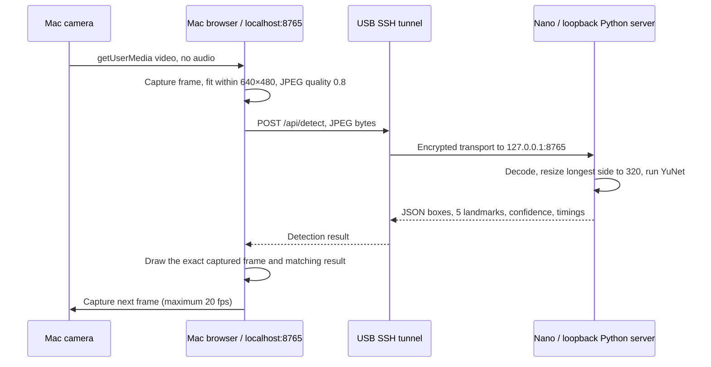

# Nano Face: Mac camera, Jetson face detection

A local browser app captures the Mac camera, sends JPEG frames to the Jetson Orin Nano Super over USB SSH, and displays each captured frame with face boxes, confidence scores, and five facial landmarks returned by the Nano. The browser performs no face inference. No cloud service, account, Docker container, microphone, or recording is used.

## Start

Connect the Nano's USB-C data port to the Mac and power it with its DC adapter. From the Mac:

```bash
cd ~/GWorkspace/nano-face
python3 launch.py
```

The launcher checks that `ssh nano` identifies an **Orin Nano**, deploys the app into `/home/<user>/nano-face`, starts the detector, opens an SSH tunnel, and opens **http://127.0.0.1:8765** in your default browser. Leave the terminal running. Click **Start camera**, grant camera access, and face the camera. Camera selection becomes available after the first permission grant; stop before selecting another camera. Browser camera permissions and macOS permissions may both be required.

Alternatively, double-click **[Launch Nano Face.command](Launch%20Nano%20Face.command)** in Finder. It runs the same launcher in Terminal.

Use **Stop camera** to release the camera and clear the frame. Hiding the tab also stops capture. **Ctrl+C in the launcher terminal** stops the Nano process and SSH tunnel. Nothing is enabled at boot. The existing headless configuration remains in place.

Options:

```bash
python3 launch.py --no-browser
python3 launch.py --port 8766
python3 launch.py --host nano
```

`--port` changes both endpoints of the tunnel. Only use the SSH alias of the Nano; the launcher rejects a different board. A dropped SSH connection ends the session; reconnect USB and rerun the launcher, then start the camera again.

## Requirements and verified device

- Mac: Python 3, OpenSSH (`ssh` and `scp`), and a browser supporting `getUserMedia` and canvas JPEG encoding. No Python packages or Node build step are needed on the Mac.
- Nano: Python 3, NumPy, and OpenCV **4.8 or newer with `FaceDetectorYN`**. The verified Nano already supplies Python 3.10.12, NumPy 1.21.5, and NVIDIA's OpenCV 4.8.0. The implementation deliberately uses the 2023 YuNet model compatible with OpenCV 4.x.
- USB SSH: `nano` resolves to `<user>@192.168.55.1` with `HostKeyAlias jetson-orin-nano-<nano-serial>`. Passwordless key authentication is required by the launcher. No sudo is needed to run detection.
- [NANO.md](NANO.md) documents Ubuntu 22.04.5 / L4T 36.4.7, the EVO SSD, and the complete connection setup. This application targets the Nano, not the separate AGX Orin.

## Where each step runs



The Nano also has Wi-Fi, but the configured SSH destination is the USB address. No frames are sent through Wi-Fi or a cloud endpoint by this application. USB is used as an Ethernet link, not as a USB webcam device; the Nano does not need a directly attached camera.

The browser loads the HTML, CSS, JavaScript, and API through the same localhost origin. SSH forwards that port to the Nano's loopback-only server. Browsers treat localhost as a secure context for camera access; a plain `http://192.168.55.1` page would not provide the same camera permission behavior. The actual camera is the Mac's camera because `getUserMedia` runs in the Mac browser, regardless of where the HTML is served.

## Detection process

1. The camera supplies video to a hidden, muted `<video>` element. The browser requests 640×480 at 20 fps, but the camera may negotiate another size.
2. Before each request, the browser preserves the aspect ratio and scales a fresh frame to fit within 640×480. It encodes this frame into an in-memory JPEG at quality 0.8.
3. The Nano accepts only a JPEG body of 1–1,000,000 bytes from the permitted localhost origin. Decoded dimensions are capped at 1280×720, including a pre-decode OpenCV allocation limit. Invalid requests are rejected.
4. OpenCV decodes the JPEG to a BGR image. The Nano scales the longest side to at most 320 pixels, preserving aspect ratio, and updates YuNet's input size.
5. YuNet runs through OpenCV DNN on **two CPU threads on the Nano**. The score threshold is **0.8**, non-maximum suppression threshold **0.3**, and top-K **500**. The model is loaded once per server session. No identity recognition or face database is involved.
6. Each detection contains a rectangle, five landmark points (eyes, nose, mouth corners), and a confidence score. Coordinates are rescaled independently along X and Y to the submitted frame; boxes are clipped to its boundaries.
7. The response returns JSON only. The browser still holds the corresponding captured frame, so it draws boxes and landmarks on that exact frame. Mirroring transforms the frame and geometry together; confidence labels remain readable.

"Tracking" here means continuously detecting and following visible face positions in successive frames. There are no persistent person IDs, identity matching, or motion predictions between detections. Several faces can be displayed. Faces leaving the frame disappear on the next result.

## Latency and resource use

Only **one frame request is in flight** per tab. The next frame is captured after the preceding result, with a maximum loop rate of 20 fps. Slow inference reduces the update rate instead of building a queue of stale video. A second tab encountering a busy detector gets HTTP 429 rather than adding an inference queue.

The display is the latest completed detection frame, so its video is delayed by processing and transport time. It is intentionally not a separate live preview with stale boxes painted over it. During a stall it holds the last frame until the five-second request timeout, then clears the view and releases the camera.

The UI reports:

- **Detection rate:** completed frames divided by elapsed time since capture started.
- **Nano inference:** time inside `FaceDetectorYN.detect`, excluding JPEG decoding, resizing, transport, and drawing.
- **Frame round trip:** browser time from capture through JPEG encoding and response parsing, approximately excluding camera exposure and screen refresh.

The default CPU backend uses the OpenCV already installed on the Nano. This does not use CUDA or TensorRT, and does not claim GPU acceleration. Performance measurements from the completed validation are recorded below. GPU conversion is unnecessary unless actual required resolution/frame rate exceeds the measured CPU path.

## API and isolation

| Endpoint | Request | Response |
| --- | --- | --- |
| `GET /api/health` | Localhost Host header | Service, Nano hostname, YuNet version, backend, OpenCV version, launcher session ID |
| `POST /api/detect` | `Content-Type: image/jpeg`, same-origin `Origin`, Content-Length, raw JPEG | `width`, `height`, `faces`, `inference_ms`, `processing_ms` |

Each face has `box: [x, y, width, height]`, `landmarks: [[x, y], ...]`, and `confidence`. Coordinates refer to the submitted image, before optional preview mirroring. `processing_ms` includes Nano JPEG decoding, resizing, and detection; it does not include network transfer.

The server binds only to `127.0.0.1` on the Nano; the SSH forward binds only to `127.0.0.1` on the Mac. It serves an explicit allowlist of static files, validates Host and Origin, does not enable cross-origin access, disables HTTP caching, and grants camera access only to the app's own origin. The model, Python source, and home directory are not served over HTTP.

Frames exist transiently in browser/server memory. The app does not save images, video, face embeddings, or request bodies, and loads no analytics or external assets. Ordinary OS memory management (including swap) is outside this application-level no-recording guarantee. Other local processes with access to either machine remain within the trust boundary.

## Files and model provenance

| File | Responsibility |
| --- | --- |
| `launch.py` | Mac deployment, board check, SSH tunnel, browser launch, session cleanup |
| `Launch Nano Face.command` | Double-click entry point for macOS Terminal |
| `server.py` | Nano HTTP API, bounded decoding, YuNet inference, static serving |
| `static/index.html`, `style.css`, `app.js` | Camera permissions, capture loop, matched-frame rendering, UI |
| `test_server.py` | Real inference, malformed-input, coordinate, isolation, and backpressure checks |
| `models/face_detection_yunet_2023mar.onnx` | Bundled 232,589-byte model, no runtime download |
| `models/LICENSE` | YuNet's MIT license and copyright notice |

Model source: OpenCV Zoo revision **`47534e27c9851bb1128ccc0102f1145e27f23f98`**, path `models/face_detection_yunet/face_detection_yunet_2023mar.onnx`.

SHA-256 (checked every server startup):

```text
8f2383e4dd3cfbb4553ea8718107fc0423210dc964f9f4280604804ed2552fa4
```

The launcher keeps an SSH session with an open stdin pipe. The server watches that pipe and shuts down when it reaches EOF, so closing the launcher/SSH connection releases the detector. It installs no service, changes no boot settings, and does not start Docker, Ollama, or jtop.

## Testing

On the Nano after deploying:

```bash
cd ~/nano-face
python3 -m unittest -v test_server
```

This uses real YuNet inference on a blank frame and covers invalid JPEGs, oversized bodies/dimensions, wrong content types, foreign origins, wrong hosts, static-file boundaries, and busy-detector rejection. The positive-face test requires an explicitly supplied image:

```bash
FACE_TEST_IMAGE=/tmp/face-test.jpg python3 -m unittest -v test_server
```

The test letterboxes that image into a non-square frame to exercise coordinate mapping. It is never populated automatically from your camera. Use a face image you are authorized to use; keep it outside the repository.

### Verified results — September 10, 2026

- All **six test cases passed on the actual Nano**, including the supplied public face image. The positive case checks a letterboxed 768×576 image and its half-size copy for consistent coordinates. The fixture was OpenCV 4.8.0's [sample image](https://github.com/opencv/opencv/blob/4.8.0/samples/data/lena.jpg), downloaded only to `/tmp/nano-face-test.jpg` on the Mac and Nano, not included in this repository.
- Live Chrome testing used the **MacBook Pro Camera** and the actual USB-connected Nano. One visible face was detected with an aligned rectangle, confidence label, and five landmarks across hundreds of consecutive frames.
- Observed at 640×480 capture and 320×240 inference: **19.7 completed fps**, **13–19 ms Nano inference**, and **27–43 ms frame round trips** in sampled UI readings. These are observations from this setup, not guaranteed performance or a sustained benchmark across workloads.
- Mirror and landmark toggles, Stop, camera restart, and restart after redeployment were exercised in the browser.
- Closing the launcher during capture closed both the Nano listener and Mac tunnel. The browser showed `NANO DISCONNECTED`, released the camera, cleared the frame/metrics, and disabled Start until reconnection.
- Python compilation and JavaScript syntax checks passed. A local code review was completed; CodeRabbit CLI was installed but signed out, so no CodeRabbit automated review result is claimed. Optional authentication command: `coderabbit auth login`.
- Remaining manual compatibility checks: camera-denied/no-camera states, background-tab suspension in a normal browser session, alternate cameras, and browsers other than Chrome. Those paths are implemented but were not fully exercised in the single-camera live test. Browser automation kept the document reported as visible during tab switching, so it did not establish background suspension behavior.

## Troubleshooting

- **No Nano connection:** check `ssh nano`, power, and the USB data cable. Keep the launcher terminal open. Do not connect both Jetsons on the same default USB subnet.
- **Permission denied:** allow camera access for the page and browser in macOS System Settings → Privacy & Security → Camera. Retry Start. No microphone permission is needed.
- **Camera busy:** close other apps using it. Stop the preview before changing the camera selector.
- **Port occupied:** close the previous launcher or use `--port 8766`. The launcher verifies a fresh random session ID before opening the page, rather than accepting an unrelated server's health response.
- **Detector busy:** use one camera tab per Nano server. Close another preview and restart capture.
- **No face:** improve lighting, face the camera, and move to a moderate distance. Small, obscured, or sharply rotated faces may be missed. Confidence is a detector score, not an identity probability.
- **Slow updates:** check Nano load, reduce competing workloads, and inspect the displayed inference/round-trip times. The cap is 20 fps, not a guaranteed minimum.
- **Model checksum error:** redeploy the original bundled model. Do not replace it with a Git LFS pointer text file or an unverified model.
- **OpenCV missing:** use the Nano's system `/usr/bin/python3`, which was verified with OpenCV 4.8.0. A fresh virtual environment may hide NVIDIA's system packages. Do not blindly replace NVIDIA's OpenCV with a pip wheel.
- **After unplug/replug or reboot:** rerun the launcher. No background auto-start service is installed.

## References

- [OpenCV 4.8 face detection tutorial](https://docs.opencv.org/4.8.0/d0/dd4/tutorial_dnn_face.html)
- [Pinned YuNet model and license](https://github.com/opencv/opencv_zoo/tree/47534e27c9851bb1128ccc0102f1145e27f23f98/models/face_detection_yunet)
- [MDN: getUserMedia and camera permission](https://developer.mozilla.org/en-US/docs/Web/API/MediaDevices/getUserMedia)
- [MDN: localhost secure contexts](https://developer.mozilla.org/en-US/docs/Web/Security/Defenses/Secure_Contexts)

Assistant-run local shell commands in this workspace use the required `rtk` prefix; commands shown here are ordinary interactive terminal commands.
